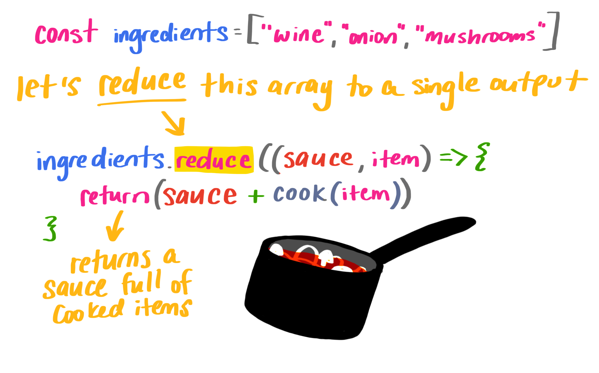

# Independent Learning Project - .reduce() Method

## Introduction


## Algorithm Description
The .reduce method in JavaScript is a powerful array method that is used to transform an array into a single value. It iterates over each element of the array and applies a callback function to accumulate a result. 

1. 
```js
// insert test array here when ready

```

2. 


```js
// insert test function here 

```

3.

```js

// insert test here 

```

4. 


```js

// insert test here 

```

5. 


## Big O Evaluation


### Time Complexity


```js
// BIG O evaluation re written with code and explanation


```

### Space Complexity


## Use Cases


## Edge Cases and Concerns


If the array only has one element (regardless of position) and no initialValue is provided, or if initialValue is provided but the array is empty, the solo value will be returned without calling callbackFn.

If initialValue is provided and the array is not empty, then the reduce method will always invoke the callback function starting at index 0.

If initialValue is not provided then the reduce method will act differently for arrays with length larger than 1, equal to 1 and 0, 

## Citations


EDGE CASES REFRENCE
https://developer.mozilla.org/en-US/docs/Web/JavaScript/Reference/Global_Objects/Array/reduce

